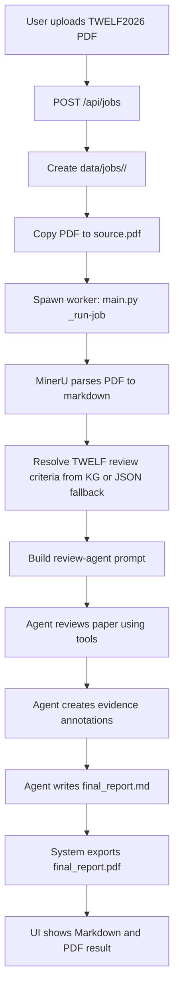

# Example Input and Project Run Result

This note shows one concrete example input and how the system runs that input through the peer-review pipeline.

## Example Input

Use the TWELF proposal paper as the uploaded manuscript.

| Field | Example value |
| --- | --- |
| PDF file | `TWELF2026_Proposal_Dang_Khoi_Nguyen.pdf` |
| Optional title | `TWELF2026 Proposal - Dang Khoi Nguyen` |
| Venue | `TWELF` |
| Journal | empty |
| Domain | `Educational Technology` |
| Article type | `full_paper` |

The web UI sends these fields to the backend as `multipart/form-data`.

```text
POST /api/jobs

file = TWELF2026_Proposal_Dang_Khoi_Nguyen.pdf
title = TWELF2026 Proposal - Dang Khoi Nguyen
review_venue = TWELF
review_domain = Educational Technology
review_article_type = full_paper
```

The backend creates a job and returns a response like this:

```json
{
  "job_id": "6b7a3c2e-1234-4567-8901-abcdef123456",
  "status": "queued",
  "message": "Job created"
}
```

## Runtime Flow



## What Each Stage Does

1. **Upload and job creation**

   The UI submits the PDF and optional metadata to `POST /api/jobs`. The backend validates the PDF, creates a unique `job_id`, saves job state, and copies the PDF into the job folder.

2. **Background worker**

   The backend starts a separate worker process with:

   ```text
   main.py _run-job --job-id <job_id>
   ```

   This keeps the web server responsive while the review runs.

3. **PDF parsing**

   MinerU parses the source PDF into markdown and layout metadata. The system saves files such as:

   ```text
   data/jobs/<job_id>/mineru_full.md
   data/jobs/<job_id>/mineru_content_list.json
   ```

4. **KG criteria resolution**

   The system uses the provided metadata:

   ```text
   venue = TWELF
   domain = Educational Technology
   article_type = full_paper
   ```

   It tries to retrieve matching review criteria from the knowledge graph. If the graph is unavailable or no matching graph result is found, it can use the extracted JSON criteria fallback.

5. **Agent review**

   The review agent receives the paper markdown, KG criteria, and tool instructions. It uses tools such as PDF search, line reading, annotation, paper search, and final report writing.

6. **Final output**

   When the review is completed, the system writes:

   ```text
   data/jobs/<job_id>/final_report.md
   data/jobs/<job_id>/final_report.pdf
   ```

## UI Progress

The UI polls these endpoints while the job is running:

```text
GET /api/jobs/<job_id>
GET /api/jobs/<job_id>/events?after=<line_number>
```

Typical status sequence:

```text
queued
pdf_uploading_to_mineru
pdf_parsing
agent_running
final_report_persisting
pdf_exporting
completed
```

## Expected Result

For this TWELF example, the final report should include:

- paper summary
- strengths
- weaknesses
- key issues
- actionable suggestions
- evidence annotations from the PDF
- score or assessment section
- TWELF-specific criterion grounding if the KG or JSON fallback returns TWELF criteria

The result can be viewed in the web UI after completion or fetched directly:

```text
GET /api/jobs/<job_id>/report.md
GET /api/jobs/<job_id>/report.pdf
```
