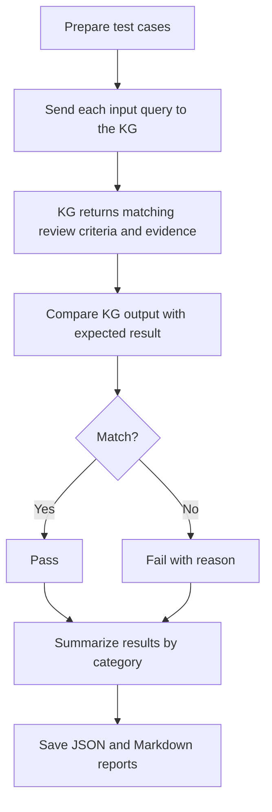

# KG Evidence Retrieval Test Results

Generated: 2026-06-09T13:35:39.299586+00:00

## Statistic Results

| Metric | Value |
|---|---:|
| Test cases | 186 |
| Passed | 165 |
| Failed | 21 |
| Pass rate | 0.8871 |

### Category Summary

| Category | Cases | Passed | Failed |
|---|---:|---:|---:|
| aspirational_unsupported_inputs | 15 | 0 | 15 |
| case_format_tolerance | 12 | 10 | 2 |
| missing_optional_fields | 12 | 10 | 2 |
| no_match_and_fallback | 20 | 20 | 0 |
| positive_retrieval | 102 | 100 | 2 |
| wrong_filter_rejection | 25 | 25 | 0 |

[Download full case-level Excel result](../test/output/kg_evidence_retrieval_test_results.xlsx)

## What This Benchmark Evaluates

This benchmark checks whether the Knowledge Graph (KG) retrieval layer can return the correct review-criteria evidence for realistic venue, journal, domain, and article-type inputs. It is focused on **KG evidence retrieval behavior**, not full paper-review quality.

The test answers this question:

> Given a review context, can the KG retrieve the expected source document, review criterion, and evidence requirement?

The benchmark is useful because the review agent depends on this KG output before it writes criterion-grounded feedback. If the KG retrieves the wrong venue criteria, misses evidence requirements, or fails to handle common input variations, the final review can become less reliable.

## How The Test Runs

Each test case provides an input query, such as:

```json
{
  "venue": "TWELF",
  "domain": "Educational Technology",
  "article_type": "full_paper"
}
```

The test runner sends that query to the KG retrieval function. The returned result is compared against expected identifiers:

- expected KG source document IDs
- expected review criterion IDs
- expected evidence requirement IDs

The benchmark does not ask an LLM to judge the answer. Pass/fail is computed with deterministic matching against the expected KG IDs.

## Test Flow



In simple terms, each test case asks the KG a question such as:

```text
For this venue/journal/domain/article type,
which review criteria and evidence should be returned?
```

The returned KG result is then compared with the expected source, criterion, and evidence IDs. Because the result is checked by exact IDs, the benchmark is repeatable. The same KG state and same test cases should produce the same pass/fail result.

## How Pass And Fail Are Decided

A case is marked **PASS** when the KG behavior matches the expected behavior for that scenario.

For positive retrieval cases, this means:

- the KG returns the correct source document
- the expected criterion appears in the retrieved criteria
- the expected evidence requirement appears in the retrieved evidence

For rejection and fallback cases, this means:

- the KG avoids guessing when the venue or journal is unknown
- the KG rejects criteria when domain or article type filters do not match
- the KG handles simple formatting differences such as lowercase input, year suffixes, or known aliases

A case is marked **FAIL** when the KG does not retrieve the expected source, criterion, or evidence, or when it retrieves criteria that should have been rejected. In this benchmark, the failed cases are intentionally hard future-work scenarios. They test behavior such as typo correction, loose semantic aliases, and question-only routing.

## Category Meaning

| Category | Purpose | Example input | Expected behavior | What the result means |
|---|---|---|---|---|
| `positive_retrieval` | Tests the normal happy path where the user gives enough structured metadata for the KG to find the right source. | `venue=TWELF`, `domain=Educational Technology`, `article_type=Long paper 3-5 pages` | The KG should return the expected source document, criterion ID, and evidence IDs. | Passing this category means the KG works well when the input clearly names a known conference or journal. |
| `missing_optional_fields` | Tests whether the KG still works when some fields are absent. This reflects real UI use where the user may only provide venue or journal. | `venue=ICLR` with no domain or article type, or `journal=ETRD` with no venue. | The KG should still retrieve the correct source and at least a useful set of criteria for that host. | Passing this category means the system does not require every metadata field to be filled before it can retrieve criteria. |
| `case_format_tolerance` | Tests simple normalization and alias handling. These cases are common because users may type names in different formats. | `venue=iclr`, `venue=AAAI 2026`, `journal=Computers and Education`, `venue=ACM CHI`. | The KG should map the variant to the correct canonical source, such as mapping lowercase or long names to the same stored venue/journal. | Passing this category means the retriever is robust to simple formatting changes, year suffixes, and known aliases. |
| `no_match_and_fallback` | Tests unknown or underspecified hosts where the KG should not invent a match. | `venue=Imaginary Conference on Agentic Widgets` or a known domain with no venue/journal. | The KG should return no criteria instead of guessing a nearby conference or journal. | Passing this category means the system has a safe fallback behavior for unknown inputs. |
| `wrong_filter_rejection` | Tests known hosts combined with mismatched domain or article type filters. | `venue=ICLR`, `domain=Educational Technology`, or `journal=ETRD`, `article_type=CHI full paper`. | The KG should reject criteria when the host exists but the filters do not apply. | Passing this category means domain and article-type filters reduce false-positive retrieval. |
| `aspirational_unsupported_inputs` | Tests difficult future-work behavior that the current system is not expected to solve yet. These cases intentionally represent messy real-world inputs. | `venue=NeruIPS`, `venue=ICLM`, `question=Which guideline checks technical soundness?`, or loose phrases like `learning representations conference`. | Ideally, a stronger system would use typo correction, semantic matching, or natural-language routing to find the intended source. | Failing this category means the current KG retriever depends on recognizable structured inputs and does not yet support fuzzy semantic routing. |

### Category Details

**`positive_retrieval`**

This is the strongest evidence that the KG works for normal review use. A case in this category already knows the venue or journal and asks for a specific expected source/criterion/evidence combination. These cases are closest to how the review agent uses the KG after a paper venue is known.

**`missing_optional_fields`**

These cases check whether the retriever can still return useful criteria when metadata is incomplete. For example, if the user only enters `ICLR`, the system should not fail just because domain or article type is empty.

**`case_format_tolerance`**

These cases check basic real-world input variation. The KG should not be fragile when a user types lowercase names, long-form names, or names with year suffixes.

**`no_match_and_fallback`**

These cases check safe behavior when the input does not match any known KG host. A pass means the retriever returns an empty result instead of hallucinating a source document based on broad words such as `review`, `learning`, or `conference`.

**`wrong_filter_rejection`**

These cases check whether filtering works after a known venue or journal is found. A pass means the KG does not return ICLR, CHI, TWELF, or journal criteria when the requested domain or article type conflicts with the stored criteria applicability.

**`aspirational_unsupported_inputs`**

These are deliberately hard cases. They are included to show the system boundary, not to hide failure. Examples include typos such as `NeruIPS`, semantic-only phrases such as `Learning Representations conference`, and question-only inputs without structured venue or journal metadata. The current system fails these because it mostly uses exact, alias, and simple substring matching. Improving this category would require fuzzy matching, richer alias dictionaries, or embedding/semantic retrieval over KG source and criterion text.


## Result Interpretation

The current result is:

```text
165 / 186 cases passed
Pass rate: 88.71%
Failure rate: 11.29%
```

Failed categories in this run:

- `aspirational_unsupported_inputs`: 15 failed out of 15
- `case_format_tolerance`: 2 failed out of 12
- `missing_optional_fields`: 2 failed out of 12
- `positive_retrieval`: 2 failed out of 102

This means the current KG retrieval is strong for many structured, fallback, and rejection scenarios, but still has gaps around broad domain synonyms, unsupported abbreviations, typo correction, fuzzy semantic matching, and question-only routing.

## What The Result Means For The Project

This benchmark result can be used as a reference for the current KG retrieval module, but it should not be interpreted as full system performance across all papers. The benchmark mainly tests whether the KG can retrieve review criteria correctly. It does not evaluate whether the final LLM-generated review is correct, complete, or useful.

In practical terms:

- The KG is strong for known structured inputs.
- The KG is acceptable for simple input variations.
- The KG safely avoids guessing for unknown hosts.
- The KG rejects known hosts when domain or article-type filters conflict.
- The KG needs improvement for real-world messy inputs, broader domain labels, and abbreviation-heavy queries.
- The full review quality still depends on PDF parsing, prompt construction, agent tool use, annotation quality, and final report generation.

## Suggested Improvements

To improve the failed cases, the next KG retrieval upgrade should add:

1. Typo-tolerant venue and journal matching, for example mapping `NeruIPS` to `NeurIPS`.
2. Stronger alias dictionaries, for example mapping `Learning Representations conference` to `ICLR`.
3. Semantic retrieval over source names, criterion names, and evidence descriptions.
4. Natural-language query routing so question-only inputs can still find the right KG source.
5. Confidence scoring so uncertain matches can be shown to the user instead of silently failing.

